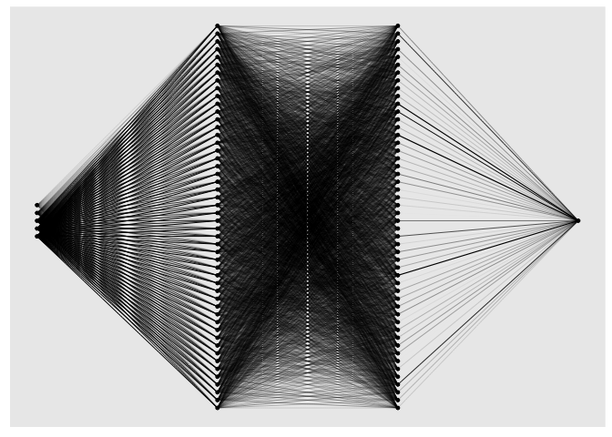

<!-- README.md is generated from README.Rmd. Please edit that file -->

# cito

[](https://www.repostatus.org/#active)
[](https://www.gnu.org/licenses/gpl-3.0)
[](https://cran.r-project.org/package=cito)
[](https://github.com/citoverse/cito/actions/workflows/R-CMD-check.yaml)

<!-- badges: end -->

‘cito’ simplifies the building and training of (deep) neural networks by
relying on standard R syntax and familiar methods from statistical
packages. Model creation and training can be done with a single line of
code. Furthermore, all generic R methods such as print or plot can be
used on the fitted model. At the same time, ‘cito’ is computationally
efficient because it is based on the deep learning framework ‘torch’
(with optional GPU support). The ‘torch’ package is native to R, so no
Python installation or other API is required for this package.

## Installation

Before installing ‘cito’ make sure ‘torch’ is installed. See the code
chunk below if you are unsure on how to check this

``` r
# check package 
if(!require('torch',quietly = TRUE)) install.packages('torch')
library('torch') 

#install torch
if(!torch_is_installed()) install_torch()
```

If you have trouble installing ‘torch’, please [visit the website of the
‘torch’
package](https://torch.mlverse.org/docs/articles/installation.html) or
create an issue on [our github
website](https://github.com/citoverse/cito/issues). We are happy to help
you.

A stable version of cito from CRAN can be installed with:

``` r
install.packages("cito")
```

The development version from [GitHub](https://github.com/) can be
installed by:

``` r
if(!require('devtools', quietly = TRUE)) install.packages('devtools')
devtools::install_github('citoverse/cito')
```

## Example

Once installed, the main function `dnn()` can be used. See the example
below. A more in depth explanation can be found in the vignettes or
[here under articles](https://citoverse.github.io/cito/).

1.  Fit model with bootstrapping (to obtain confidence intervals). All
    methods work with and without bootstrapping

``` r
library(cito)
nn.fit <- dnn(Sepal.Length~., data = datasets::iris, bootstrap = 30L)
```

2.  Check if models have converged (compare training loss against
    baseline loss (=intercept only model)):

``` r
analyze_training(nn.fit)
# At 1st glance, the networks converged since the loss is lower than the baseline loss and the training loss is on a plateau at the end of the training.
```

3.  Plot model architecture

``` r
plot(nn.fit)
```

<!-- -->

4.  Return xAI effects (feature importances and average conditional
    effects) and their uncertainties:

``` r
summary(nn.fit)
```

    ## Summary of Deep Neural Network Model
    ## 
    ##  ##########################################################
    ##      Feature Importance 
    ##  ##########################################################
    ##                          Importance Std.Err Z value Pr(>|z|)    
    ## Response_1: Sepal.Width       1.619   0.455    3.56  0.00037 ***
    ## Response_1: Petal.Length     18.459   5.657    3.26  0.00110 ** 
    ## Response_1: Petal.Width       0.526   0.528    1.00  0.31947    
    ## Response_1: Species           0.319   0.187    1.70  0.08899 .  
    ## ---
    ## Signif. codes:  0 '***' 0.001 '**' 0.01 '*' 0.05 '.' 0.1 ' ' 1
    ## 
    ## 
    ##  ##########################################################
    ##      Average Conditional Effects 
    ##  ##########################################################
    ##                              ACE Std.Err Z value Pr(>|z|)    
    ## Response_1: Sepal.Width   0.7176  0.0588   12.20   <2e-16 ***
    ## Response_1: Petal.Length  0.6459  0.0617   10.46   <2e-16 ***
    ## Response_1: Petal.Width  -0.1558  0.1323   -1.18     0.24    
    ## ---
    ## Signif. codes:  0 '***' 0.001 '**' 0.01 '*' 0.05 '.' 0.1 ' ' 1
    ## 
    ## 
    ##  ##########################################################
    ##      Standard Deviation of Conditional Effects 
    ##  ##########################################################
    ##                             ACE Std.Err Z value Pr(>|z|)    
    ## Response_1: Sepal.Width  0.1421  0.0407    3.49  0.00048 ***
    ## Response_1: Petal.Length 0.1165  0.0378    3.09  0.00203 ** 
    ## Response_1: Petal.Width  0.0411  0.0196    2.10  0.03570 *  
    ## ---
    ## Signif. codes:  0 '***' 0.001 '**' 0.01 '*' 0.05 '.' 0.1 ' ' 1

5.  Predict (with confidence intervals):

``` r
dim(predict(nn.fit, newdata = datasets::iris))
```

    ## [1]  30 150   1

## Advanced

We can pass custom loss functions to ‘cito’, optionally with additional
parameters that should be fitted. The only requirement is that all
calculations must be written using the ‘torch’ package (cito
automatically converts the initial values of the custom parameters to
‘torch’ objects).

We use a multivariate normal distribution as the likelihood function and
we want to parameterize/fit the covariance matrix of the multivariate
normal distribution:

1.  We need one helper function, `create_cov()` that builds the
    covariance matrix based on a lower triangular matrix and the
    diagonals (low-rank approximation of the covariance matrix)

2.  We need our custom likelihood function which uses the
    `distr_multivariate_normal(…)` function from the torch package:

``` r
create_cov = function(L, Diag) {
  return(torch::torch_matmul(L, L$t()) + torch::torch_diag(Diag+0.01))
}

custom_loss_MVN = function(true, pred) {
  Sigma = create_cov(SigmaPar, SigmaDiag)
  logLik = torch::distr_multivariate_normal(pred,
                                            covariance_matrix = Sigma)$
    log_prob(true)
  return(-logLik$mean())
}
```

3.  We use “SigmaPar” and “SigmaDiag” as parameters that we want to
    optimize along the DNN. We will pass a named list with starting
    values to ‘cito’ and ‘cito’ will infer automatically (based on the R
    shape) the shape of the parameters:

``` r
nn.fit<- dnn(cbind(Sepal.Length, Sepal.Width, Petal.Length)~.,
             data = datasets::iris,
             lr = 0.01,
             epochs = 200L,
             loss = custom_loss_MVN,
             verbose = FALSE,
             plot = FALSE,
             custom_parameters =
               list(SigmaDiag =  rep(1, 3), # Our parameters with starting values
                    SigmaPar = matrix(rnorm(6, sd = 0.001), 3, 2)) # Our parameters with starting values
)
```

Estimated covariance matrix:

``` r
as.matrix(create_cov(nn.fit$loss$parameter$SigmaPar,
                     nn.fit$loss$parameter$SigmaDiag))
```

    ##             [,1]        [,2]        [,3]
    ## [1,]  1.64407194  0.09029449 -0.16095994
    ## [2,]  0.09029449  0.11592369 -0.02366723
    ## [3,] -0.16095994 -0.02366723  1.78725672

Empirical covariance matrix:

``` r
cov(predict(nn.fit) - nn.fit$data$Y)
```

    ##              Sepal.Length Sepal.Width Petal.Length
    ## Sepal.Length   0.24147327  0.06729894   0.12180527
    ## Sepal.Width    0.06729894  0.09605630   0.01608715
    ## Petal.Length   0.12180527  0.01608715   0.13462193
